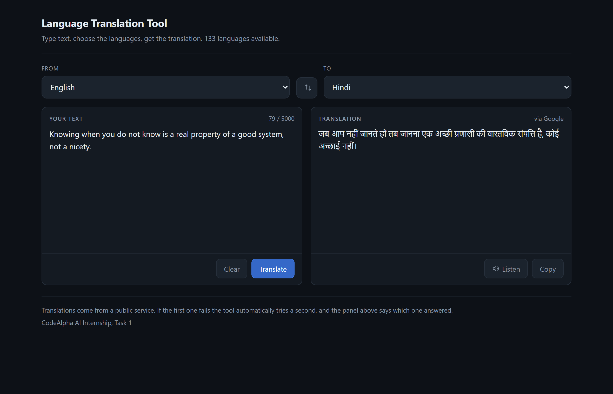
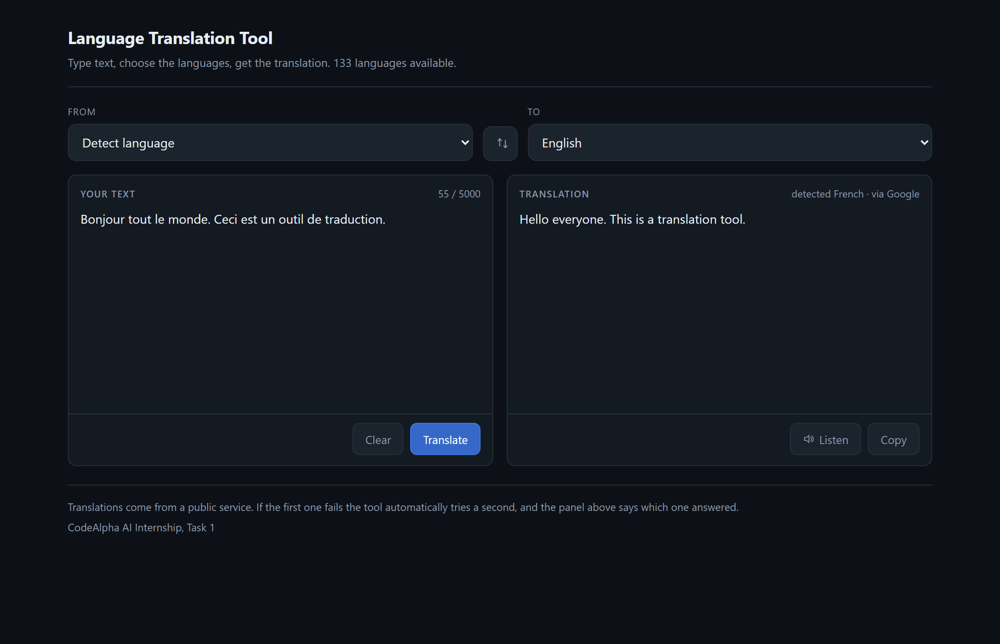
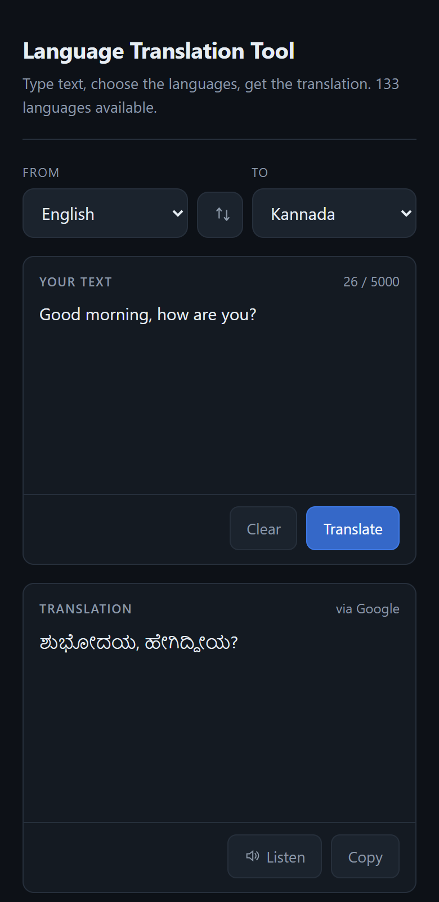

# CodeAlpha_LanguageTranslation

**CodeAlpha Artificial Intelligence Internship, Task 1: Language Translation Tool**

Type text, pick a source and target language, and get the translation back. 133
languages, automatic source detection, a copy button and text to speech.



## What it does

- Text input with a source and target language selector, and a live character count
- Automatic source detection, with the detected language named in the result
- Copy to clipboard, and read the translation aloud
- A swap button that reverses the languages and moves the translation back into
  the input box, so a round trip takes one click
- `Ctrl+Enter` translates, since plain `Enter` has to keep inserting a newline



## Two services, not one

The tool calls a public translation endpoint, and falls back to a second one if
the first fails for any reason. The panel says which service answered.

This is not over-engineering. It is a direct response to something that happened
while building this: the `deep-translator` library was the original plan, and its
Google back end had stopped working by the time it was wired up. These free
endpoints are undocumented and they change. A tool with one hard-coded service is
one silent upstream change away from being broken, and that change tends to
surface during a demo rather than during development.

| Provider | Role | Notes |
|---|---|---|
| Google public endpoint | First choice | Good quality, and it reports the detected source language |
| MyMemory | Fallback | No auto-detect, 500 characters per request, noticeably rougher output |

The fallback is genuinely worse and the README should say so rather than imply
two equal options. Asked for "Good morning" in Hindi, Google returns
`शुभ प्रभात`, which is right. MyMemory returns `मुझे गुड नाइट मत कहो`, meaning
"don't tell me good night", because it matches against a memory of previous
human translations rather than translating. It is there so the tool still answers
when the first service does not, not because it is as good.

Swapping in an official Google Cloud Translation or Azure Translator key would be
steadier than either. That means adding a class with a `translate` method to the
`PROVIDERS` list in `translator.py`. Nothing else has to change.

## Long text is split before sending

Both endpoints take the text in the query string, so a long input cannot be sent
in one request, and MyMemory rejects anything over 500 characters outright.

`split_into_chunks` breaks the text up and the pieces are rejoined afterwards.
Break points are tried in order of preference: paragraph, then line, then sentence
(including the Devanagari full stop `।`), then a space. A single word longer than
the limit is cut, because at that point there is nowhere sensible left to break.
Splitting mid-word would be visible in the output.

## Notable behaviour

**Detection is only reported when it was asked for.** The service returns the
language it identified on every request, including ones where the user picked the
source themselves. Echoing that back would just tell them what they already chose,
so it is shown only when the source is set to detect.

**Unchanged output is flagged.** If the translation comes back effectively
identical to the input, the panel says so. That usually means the text was already
in the target language, and a user staring at unchanged text deserves to be told
which of the two things happened.

**Translated text is inserted with `textContent`, never `innerHTML`.** It arrives
from an external service, so it is data, not markup.

## Setup

```bash
git clone https://github.com/gajanand27-05/CodeAlpha_LanguageTranslation.git
cd CodeAlpha_LanguageTranslation

python -m venv venv
venv\Scripts\activate          # Windows
# source venv/bin/activate     # macOS / Linux

pip install -r requirements.txt
python app.py
```

Then open http://127.0.0.1:5000

No API key and no account are needed. Flask is the only third-party requirement:
the translation layer uses `urllib` and `json` from the standard library.

## Usage

```bash
python app.py                        # the web interface
python test_translator.py            # offline test suite
python test_translator.py --live     # also calls the real services
```

## Tests

`python test_translator.py` runs 37 checks and never touches the network. The
providers are replaced with fakes, which is what makes it possible to test the
parts that matter: that a failing provider falls through to the next, that the
second is not called when the first succeeds, that an empty answer counts as a
failure, and that when everything fails the error names the first provider's
reason rather than the last.

Network calls are in a separate `--live` group that is reported but not counted.
A test that needs the internet to pass is a test that fails on a train, and a
suite that fails for reasons unrelated to the code stops being trusted.

Also covered: chunking never loses or duplicates text and always respects the
limit, input validation rejects empty, over-long and same-language requests
before any request is made, and every language code in the table is one the
service published.

## Project layout

| File | Purpose |
|---|---|
| `translator.py` | Providers, fallback, chunking, validation. No Flask, no web |
| `languages.py` | The 133 language codes, generated from the service's own list |
| `app.py` | Flask server: one page, one `/api/translate` endpoint |
| `templates/`, `static/` | The interface: HTML, CSS and vanilla JavaScript |
| `test_translator.py` | Test suite |

## Interface on a narrow screen



## Author

Built by **gajanand27-05** as part of the CodeAlpha AI Internship.
